# SEI-project-3: GigMe
## Overview

GigMe is a community site, finding the best local gigs in near you. The API has been built with gigs, but also allows you to add some gigs in yourself when you have logged into the app. The brief was to create a full stack application.
This was my thirs project in General Assembly's Software Engineering Immersive course. It was a group project assigned after 8 weeks of coding, and 1 week of learning MongoDB/Express.
  

## My App

You can find the hosted version of the app here: https://gigme-sei.herokuapp.com/
  

## Timeframe and Technologies

8 days to complete, groupd of 4

Technologies:
- ReactJS
- MongoDB
- NoSQL
- Express
- Axios
- Bulma
- Insomnia
- Additional ReactJS dependencies/front-end libraries e.g. MapBox, Calendar
  

## Website Details

1. On loading the Site you are met with our home page, which hosts our hero image, featured artists, maps  and a calendar. This can be viewed by any user, not specific to login or sign up.
  

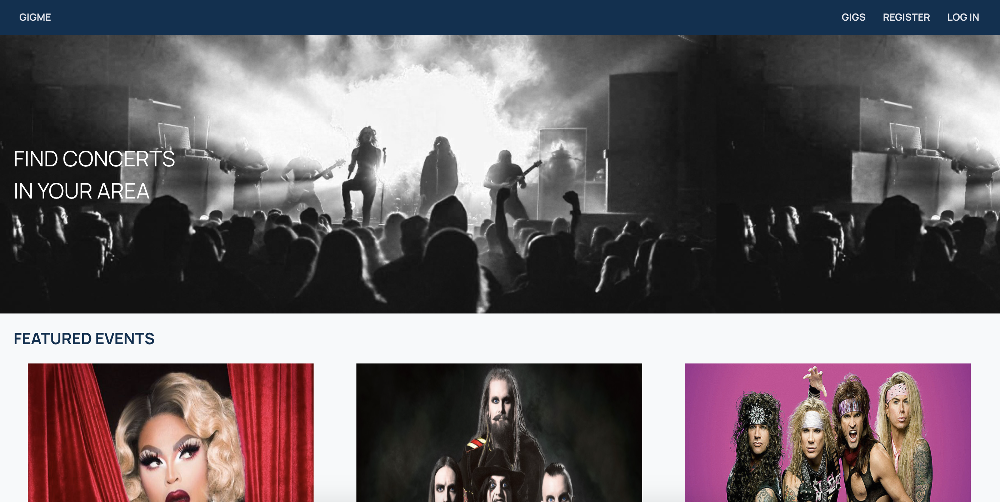 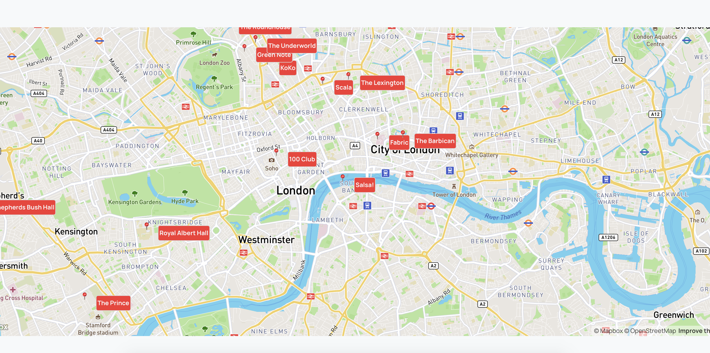 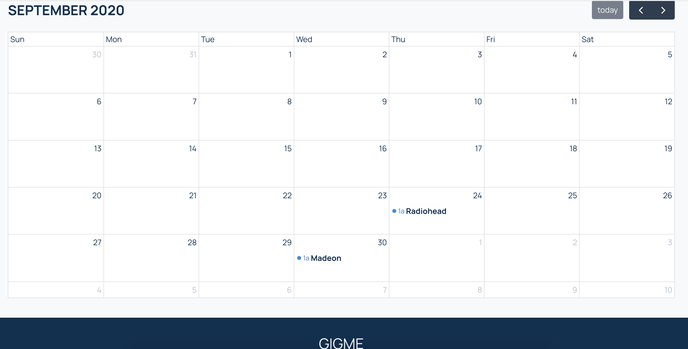
  

2. You can navigate around the site without being logged in, however your view will be limited. You can still see all the artists when you click on the all artists button. This will take you to the index page which displays all gigs in our API. Here you can filter through the different categories e.g. Classical gigs, rock gigs etc.
  

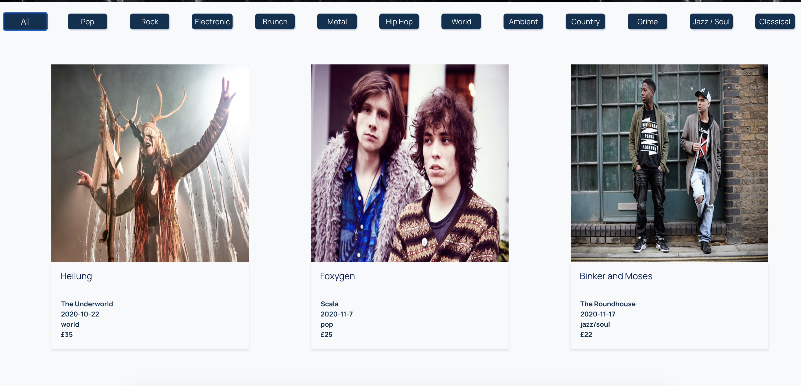 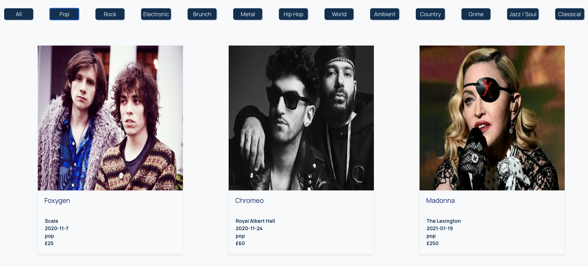
  

3. When you click through on one of the gigs it will take you through to the individual page of the gig which will give you the details of it. The view and functionality will differ depending on whether you are logged in or not. If you wish to like/comment on the gig you will have to register and log it.
  

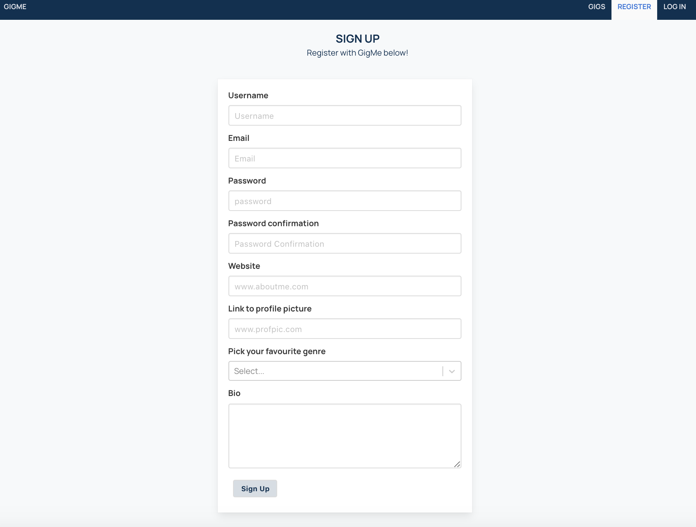 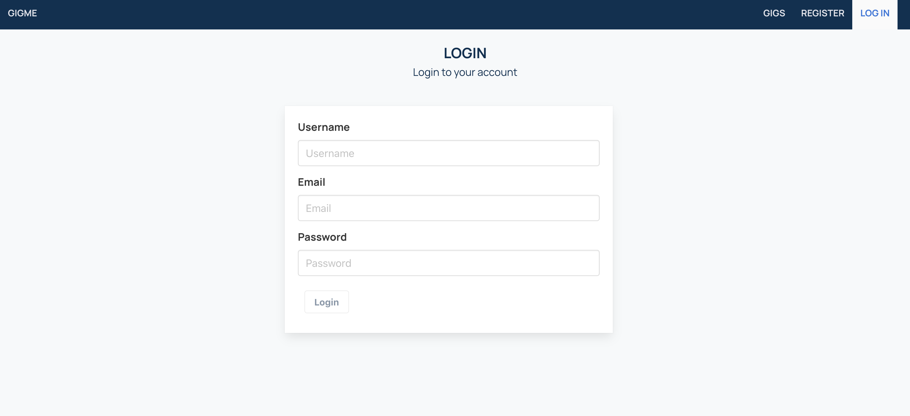
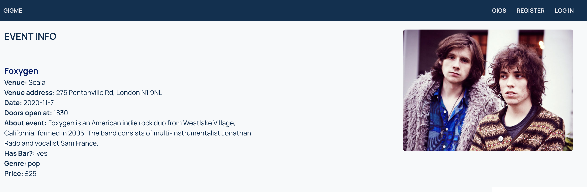 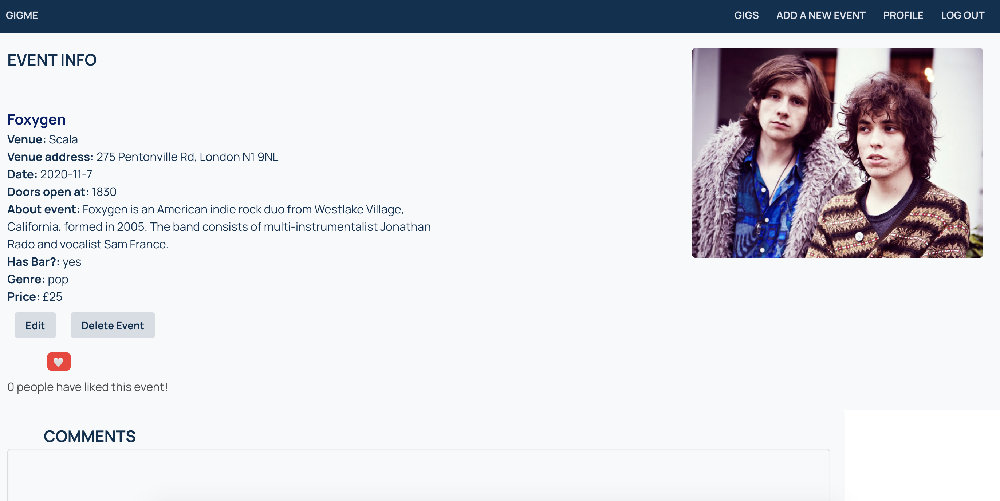
  

4. When logged in, it also exposes additional functionality of the site, e.g. the ability to add gigs and edit them too.  You can also see what other members activity when you click through to their profile.
  

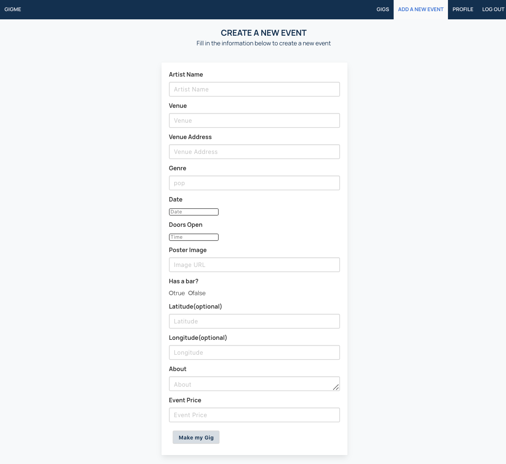 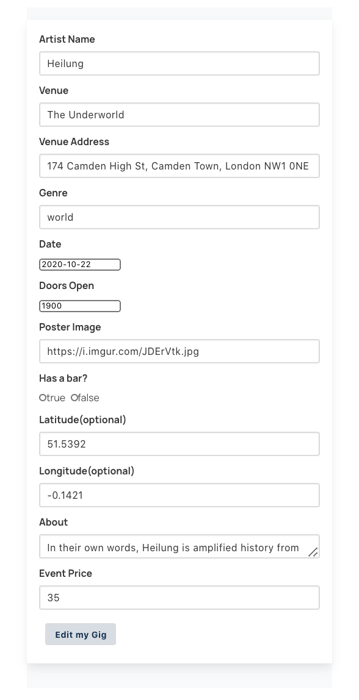
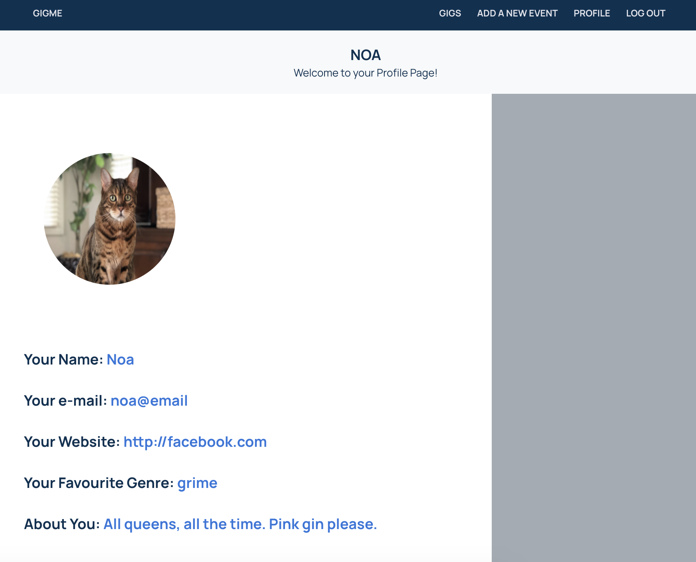
  

5. Error handling, we put some error handling in place on the login and register forms.
  

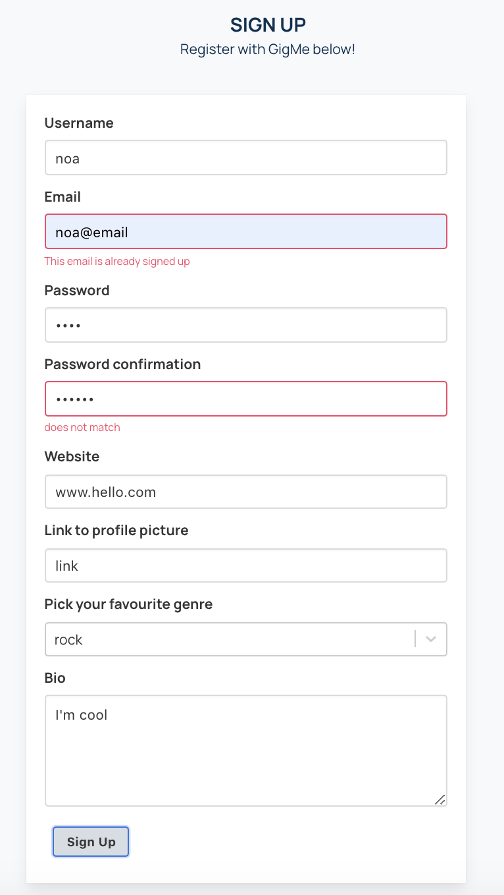 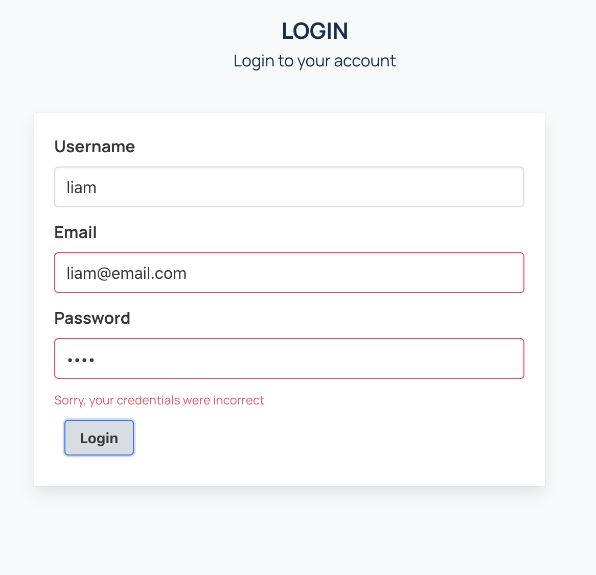
  

## Process

We began the project by drawing up some wireframes of what we wanted our site to look like and so that we could map out the end goal and work back. This helped us also identify what we wanted our backend to look like and what sort of relationships we weanted. We also used trello to track our progress and work as a project management tool.
  

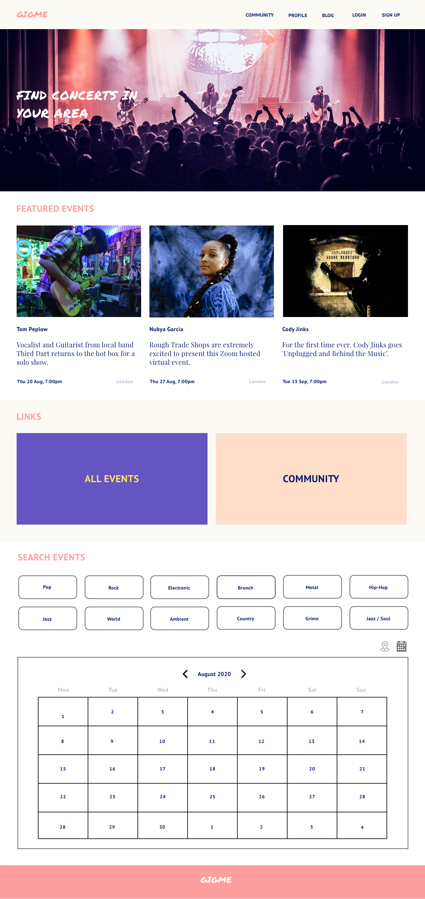 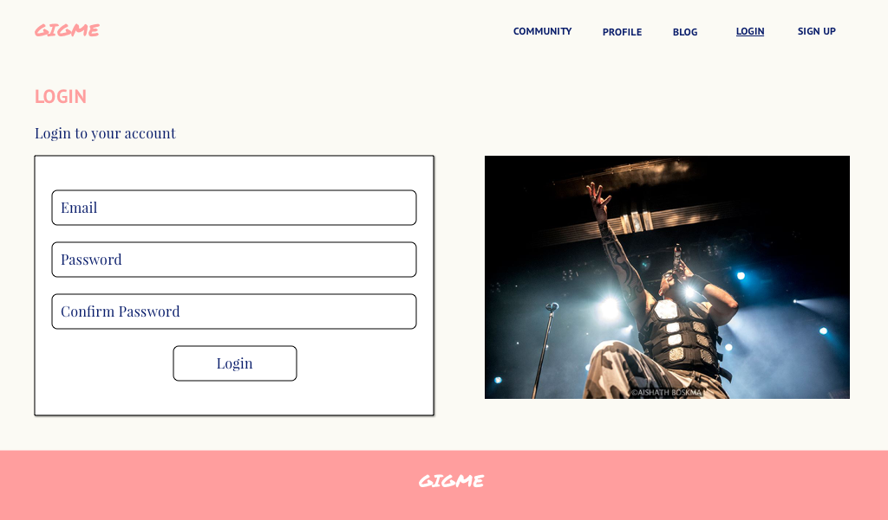
  

We then split off and 2 of us focused on creating our data requests on the backend, testing them as we went through insomnia and making sure the right relationships were there. The other half of the group made initial components for our frontend. Once the backend was in a place we were happy with, we decided to focus on mounting the data on the front end and making requests. We split the workload relatively similarly and focused on creating user interaction first and going from there. Once all our data was successfully mounted we worked towards post-mvp ideas and styling. This was also split relatively evenly, with more complex tasks sometimes pair-coded to get more eyes on the task!

Throughout the week we set up our day with stand-up, splitting up and dividing tasks and ensuring we were on the same page. We would communicate throughout the day (using slack and zoom, as we were working remotely), sending updates and jumping in to help others where possible. Communication meant we could reach our MVP on time and spend time styling, error handling and ensuring the best ux we could possible.
  

#### My specifc role:
- Throughout the project I led as Project Manager, this largely involved decision making e.g. the layout of our homepage and how many components would be used. I also worked to manage time and task assignment. This was key in our first group project in establishing boundaries and working styles. I led on making sure everyone was on track and keeping to time-scales we set (e.g. actively working towards MVP).
- Back-End: followed an MVC framework. I led on creating the models, requests and routes. Working with the schema and amending where needed.
- Authentication: implementation of Authentication on the Back-End, as well as data requests of users on the Front-End e.g. in login and register forms.
- Error-Handling: coding this into our Back-End e.g. by creating errorHandler file and then importing this and using it in our different controllers. Then implemented it in Front-End and supplemented this use through Bulma class and conditional rendering.
  

## Challenges

A big challenge was learning to work as a group and aligning on concept, as well as workload initially. Some tasks were more complicated and it was hard as everyone wanted to be involved in all aspects of the project which is difficult.
  

## Future features

- Adding the 'community' feature in, which works as a chat room for the users (have the base code ready for that!)
- Adding in a 'blog' where certain members of the community could write blog posts about events that they have attended
- Functionality to purchase tickets to gigs in app (would require real data/or to be built in Shopify)
- Plug in the calendar to link up directly to the event page, instead of simply showing when they are on.
- Responsive - as it stands it isn't user friendly on mobile
- Many more!
